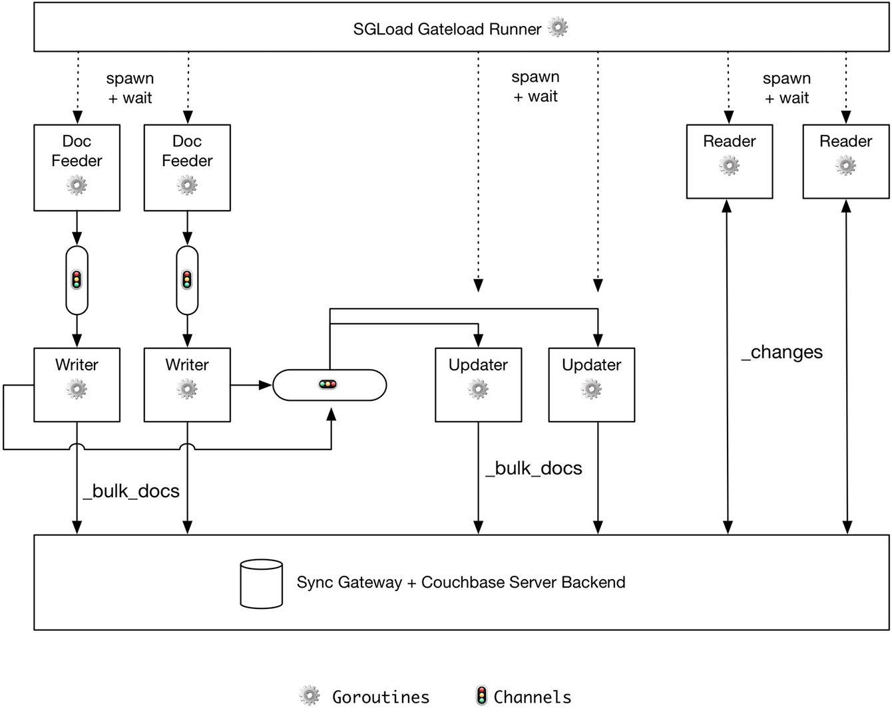

	
[](http://drone.couchbase.io/couchbaselabs/sgload) [](https://godoc.org/github.com/couchbaselabs/sgload) [](https://coveralls.io/github/couchbaselabs/sgload) [](https://goreportcard.com/report/github.com/couchbaselabs/sgload) [](https://codebeat.co/projects/github-com-couchbaselabs-sgload) [](https://gitter.im/couchbase/discuss?utm_source=badge&utm_medium=badge&utm_campaign=pr-badge&utm_content=badge)

Load testing tool for Sync Gateway that allows flexible scenarios.   Intended successor to [gateload](https://github.com/couchbaselabs/gateload).

## How to run

### Run Sync Gateway

1. Install and run Sync Gateway locally with the [basic-walrus-bucket.json](https://github.com/couchbase/sync_gateway/blob/master/examples/basic-walrus-bucket.json) example config

### Run sgload

**Go get sgload**

```
$ go get -u -v github.com/couchbaselabs/sgload
```

**Run**

```
$ sgload gateload \
    --createreaders \
    --createwriters \
    --numwriters 10000 \
    --numupdaters 10000 \
    --numreaders 100 \
    --numdocs 1000000 \	
    --numrevsperdoc 5 \
    --batchsize 100 \
    --numchannels 10 \
    --sg-url http://localhost:4984/db/ 
```

For an explanation of the above command line options, and additional options supported run `sgload --help` or `sgload gateload --help`

## Architecture



Notes:

* The gateload runner spawns for and waits for completion for the following goroutines
    * DocFeeders
    * Writers
    * Updaters
    * Readers
* There is a DocFeeder goroutine created for every Writer goroutine, and it continually feeds it docs until there are none left
* Writers write docs to Sync Gateway in batches
* After a writer writes a doc batch, it pushes these doc id's to a channel which the updaters are listening to
* Updaters read docs from the channel shared with the writers and look for new doc id's that are ready to be updated, until they have enough docs (total docs / numupdaters)
* Updaters keep updating docs until they have written the number of revisions specified in the `numrevsperdoc` command line argument
* Readers are assigned a subset of the channels (and therefore docs) to pull docs from the changes feed and will continue to pull from the changes feed until all docs are seen.

## Design

1. The docfeeder goroutine spreads the docs among the writers as evenly as possible.
1. Docs are spread evenly as possible among channels
1. Can specify existing user credentials or tell the tool to create new users as needed (access to admin port required)
1. When auto-generating users, the user id's will be unique and not interfere with subsequent runs

## Supported scenarios

* Gatealod (writer + updater + reader) -- this is the primary scenario
* Writeload -- only do writes
* Readload -- only do reads


